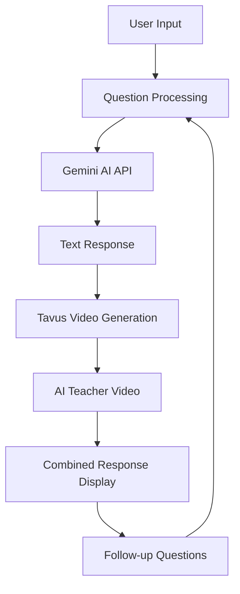

# 🎓 DoubtMaster - AI-Powered Learning Platform

<div align="center">
  
  
  [](https://bolt.new)
  [](https://reactjs.org/)
  [](https://www.typescriptlang.org/)
  [](https://vitejs.dev/)
  [](https://tailwindcss.com/)
  
  **Get instant, personalized explanations with AI-powered video teachers**
  
  [🚀 Live Demo](https://doubtmaster.netlify.app) • [📖 Documentation](#documentation) • [🤝 Contributing](#contributing)
</div>

---

## 📋 Table of Contents

- [🌟 Features](#-features)
- [🛠️ Tech Stack](#️-tech-stack)
- [🏗️ Architecture](#️-architecture)
- [🚀 Getting Started](#-getting-started)
- [🔧 Configuration](#-configuration)
- [📱 API Integration](#-api-integration)
- [🎨 UI/UX Components](#-uiux-components)
- [🔐 Authentication](#-authentication)
- [💾 Database](#-database)
- [🎬 Video Generation](#-video-generation)
- [📊 Analytics & Usage](#-analytics--usage)
- [🌐 Deployment](#-deployment)
- [🧪 Testing](#-testing)
- [📚 Documentation](#-documentation)
- [🤝 Contributing](#-contributing)
- [📄 License](#-license)

---

## 🌟 Features

### ✨ Core Features
- **🤖 AI-Powered Answers**: Get detailed explanations using Google's Gemini AI
- **🎬 Video Teachers**: AI-generated teacher videos using Tavus API
- **🎯 Multi-Subject Support**: Mathematics, Physics, Chemistry, Biology, and more
- **🗣️ Voice Input**: Speech-to-text for hands-free question asking
- **💬 Follow-up Chat**: Interactive Q&A sessions
- **📊 Progress Tracking**: Monitor learning progress and usage statistics
- **🌙 Dark/Light Mode**: Adaptive theme system
- **📱 Responsive Design**: Works seamlessly on all devices

### 🔮 Coming Soon Features
- **🎥 Learn with Animated Videos**: Interactive animated lessons
- **🧪 Try Simulations**: Virtual experiments and simulations
- **🎨 AI-Generated Simulations**: Custom simulations using AI
- **🌍 Share Your Creations**: Community sharing platform

---

## 🛠️ Tech Stack

### 🎨 Frontend Technologies

<div align="center">

| Technology | Version | Purpose | Logo |
|------------|---------|---------|------|
| **React** | 18.3.1 | UI Library for building interactive user interfaces |  |
| **TypeScript** | 5.5.3 | Type-safe JavaScript for better development experience |  |
| **Vite** | 5.4.2 | Fast build tool and development server |  |
| **Tailwind CSS** | 3.4.1 | Utility-first CSS framework for rapid UI development |  |
| **Framer Motion** | 11.0.14 | Animation library for smooth, interactive animations |  |

</div>

### 🔧 Development Tools

<div align="center">

| Tool | Version | Purpose | Logo |
|------|---------|---------|------|
| **ESLint** | 9.9.1 | Code linting and quality assurance |  |
| **PostCSS** | 8.4.35 | CSS processing and optimization |  |
| **Autoprefixer** | 10.4.18 | Automatic CSS vendor prefixing |  |

</div>

### 🌐 Backend & Services

<div align="center">

| Service | Purpose | Logo |
|---------|---------|------|
| **Firebase** | Authentication, Database, and Hosting |  |
| **Firestore** | NoSQL document database for user data |  |
| **Google Gemini AI** | Advanced AI for generating detailed explanations |  |
| **Tavus API** | AI video generation for teacher avatars |  |

</div>

### 📚 Key Libraries

<div align="center">

| Library | Version | Purpose | Logo |
|---------|---------|---------|------|
| **React Router DOM** | 6.22.3 | Client-side routing and navigation |  |
| **React Hot Toast** | 2.4.1 | Beautiful toast notifications |  |
| **Lucide React** | 0.344.0 | Beautiful, customizable SVG icons |  |

</div>

---

## 🏗️ Architecture

### 📁 Project Structure

```
doubtmaster/
├── 📁 public/                 # Static assets
├── 📁 src/
│   ├── 📁 components/         # Reusable UI components
│   │   ├── Header.tsx         # Navigation header with user menu
│   │   ├── Footer.tsx         # Site footer with links and stats
│   │   ├── SubjectCard.tsx    # Subject selection cards
│   │   ├── LoadingSpinner.tsx # Loading animation component
│   │   └── ProtectedRoute.tsx # Route protection wrapper
│   ├── 📁 contexts/           # React Context providers
│   │   ├── AuthContext.tsx    # Authentication state management
│   │   ├── ThemeContext.tsx   # Dark/light theme management
│   │   └── UsageContext.tsx   # Usage tracking and limits
│   ├── 📁 pages/              # Main application pages
│   │   ├── LandingPage.tsx    # Home page with features
│   │   ├── Dashboard.tsx      # Subject selection dashboard
│   │   ├── QuestionPage.tsx   # Q&A interface with AI
│   │   ├── ProfilePage.tsx    # User profile and settings
│   │   └── SubscriptionPage.tsx # Premium subscription plans
│   ├── 📁 services/           # API and external service integrations
│   │   ├── authService.ts     # Firebase authentication
│   │   ├── aiService.ts       # Google Gemini AI integration
│   │   ├── videoService.ts    # Video generation orchestration
│   │   ├── tavusService.ts    # Tavus API for AI videos
│   │   ├── usageService.ts    # Usage tracking and limits
│   │   └── firebase.ts        # Firebase configuration
│   ├── 📁 types/              # TypeScript type definitions
│   │   └── speech.d.ts        # Speech recognition types
│   ├── App.tsx                # Main application component
│   ├── main.tsx               # Application entry point
│   └── index.css              # Global styles and Tailwind imports
├── 📄 package.json            # Dependencies and scripts
├── 📄 tsconfig.json           # TypeScript configuration
├── 📄 tailwind.config.js      # Tailwind CSS configuration
├── 📄 vite.config.ts          # Vite build configuration
└── 📄 README.md               # This documentation file
```

### 🔄 Data Flow



---

## 🚀 Getting Started

### 📋 Prerequisites

- **Node.js** (v18 or higher) 
- **npm** or **yarn** package manager 
- **Git** for version control 

### 🔧 Installation

1. **Clone the repository**
   ```bash
   git clone https://github.com/yourusername/doubtmaster.git
   cd doubtmaster
   ```

2. **Install dependencies**
   ```bash
   npm install
   # or
   yarn install
   ```

3. **Environment setup**
   ```bash
   cp .env.example .env
   ```

4. **Configure environment variables** (see [Configuration](#-configuration))

5. **Start development server**
   ```bash
   npm run dev
   # or
   yarn dev
   ```

6. **Open in browser**
   ```
   http://localhost:5173
   ```

---

## 🔧 Configuration

### 🌍 Environment Variables

Create a `.env` file in the root directory:

```env
# 🤖 Google Gemini AI Configuration
VITE_GEMINI_API_KEY=your_gemini_api_key_here

# 🎬 Tavus Video Generation API
VITE_TAVUS_API_KEY=your_tavus_api_key_here

# 🔥 Firebase Configuration
VITE_FIREBASE_API_KEY=your_firebase_api_key
VITE_FIREBASE_AUTH_DOMAIN=your_project.firebaseapp.com
VITE_FIREBASE_PROJECT_ID=your_project_id
VITE_FIREBASE_STORAGE_BUCKET=your_project.appspot.com
VITE_FIREBASE_MESSAGING_SENDER_ID=your_sender_id
VITE_FIREBASE_APP_ID=your_app_id
VITE_FIREBASE_MEASUREMENT_ID=your_measurement_id
```

### 🔑 API Keys Setup

#### 🤖 Google Gemini AI
1. Visit [Google AI Studio](https://makersuite.google.com/app/apikey)
2. Create a new API key
3. Add to `VITE_GEMINI_API_KEY`

#### 🎬 Tavus API
1. Sign up at [Tavus.io](https://tavus.io)
2. Get API key from dashboard
3. Add to `VITE_TAVUS_API_KEY`

#### 🔥 Firebase
1. Create project at [Firebase Console](https://console.firebase.google.com)
2. Enable Authentication and Firestore
3. Copy configuration to environment variables

---

## 📱 API Integration

### 🤖 Google Gemini AI Integration

**Purpose**: Generates detailed, educational explanations for student questions

**Features**:
- Advanced natural language processing
- Subject-specific responses
- Structured output with key points and steps
- Safety filters for educational content

**Implementation**:
```typescript
// src/services/aiService.ts
export const aiService = {
  askQuestion: async (question: string, subject: string): Promise<AIResponse> => {
    // Gemini 1.5 Flash model for fast, accurate responses
    const response = await fetch(`https://generativelanguage.googleapis.com/v1beta/models/gemini-1.5-flash:generateContent?key=${GEMINI_API_KEY}`, {
      method: 'POST',
      headers: { 'Content-Type': 'application/json' },
      body: JSON.stringify({
        contents: [{ parts: [{ text: prompt }] }],
        generationConfig: {
          temperature: 0.7,
          topK: 40,
          topP: 0.95,
          maxOutputTokens: 1024,
        }
      })
    });
  }
};
```

### 🎬 Tavus Video Generation

**Purpose**: Creates AI teacher videos from text explanations

**Features**:
- Realistic AI avatars
- Natural voice synthesis
- Lip-sync technology
- Customizable video properties

**Implementation**:
```typescript
// src/services/tavusService.ts
export class TavusService {
  async generateVideo(script: string, options?: VideoOptions): Promise<TavusVideoResponse> {
    const response = await fetch(`${this.baseUrl}/videos`, {
      method: 'POST',
      headers: {
        'x-api-key': this.apiKey,
        'Content-Type': 'application/json',
      },
      body: JSON.stringify({
        script: this.prepareScript(script),
        replica_id: options?.replicaId || await this.getDefaultReplica(),
        properties: {
          voice_settings: { stability: 0.8, similarity_boost: 0.8 },
          include_captions: true,
          max_video_length: 300
        }
      })
    });
  }
}
```

---

## 🎨 UI/UX Components

### 🎭 Design System

**Theme**: Modern, educational, accessible
**Color Palette**: Blue and emerald gradients with dark mode support
**Typography**: Inter font family for readability
**Animations**: Framer Motion for smooth interactions

### 🧩 Component Library

#### 🎯 SubjectCard Component
```typescript
interface SubjectCardProps {
  subject: string;
  icon: LucideIcon;
  color: string;
  description: string;
  onClick: () => void;
}
```
**Features**: Hover animations, usage tracking, gradient backgrounds

#### 🎪 Header Component
**Features**: User authentication menu, theme toggle, premium badge, responsive design

#### 🎨 LoadingSpinner Component
**Features**: Smooth rotation animation, theme-aware colors, centered positioning

### 🎬 Animation System

**Library**: Framer Motion
**Features**:
- Page transitions
- Hover effects
- Loading states
- Scroll-triggered animations
- Gesture recognition

---

## 🔐 Authentication

### 🔑 Authentication Methods

<div align="center">

| Method | Provider | Purpose | Implementation |
|--------|----------|---------|----------------|
| **Google OAuth** |  | Quick social login | Firebase Auth |
| **Email/Password** |  | Traditional signup | Firebase Auth |

</div>

### 🛡️ Security Features

- **Protected Routes**: Automatic redirection for unauthenticated users
- **Session Management**: Persistent login state across browser sessions
- **Data Privacy**: User data isolated by Firebase security rules
- **Input Validation**: Client and server-side validation

### 🔧 Implementation

```typescript
// src/contexts/AuthContext.tsx
export const AuthProvider: React.FC<{ children: React.ReactNode }> = ({ children }) => {
  const [user, setUser] = useState<User | null>(null);
  const [loading, setLoading] = useState(true);

  useEffect(() => {
    const unsubscribe = authService.onAuthStateChange((user) => {
      setUser(user);
      setLoading(false);
    });
    return unsubscribe;
  }, []);

  // Authentication methods
  const signInWithGoogle = async () => await authService.signInWithGoogle();
  const signInWithEmail = async (email: string, password: string) => 
    await authService.signInWithEmail(email, password);
};
```

---

## 💾 Database

### 🔥 Firebase Firestore

**Purpose**: NoSQL document database for user data, usage tracking, and application state

**Collections**:

#### 👤 Users Collection
```typescript
interface UserDocument {
  uid: string;                    // Firebase user ID
  email: string;                  // User email address
  displayName: string;            // User display name
  photoURL?: string;              // Profile picture URL
  subjectUsage: Record<string, number>; // Usage per subject
  isSubscribed: boolean;          // Premium subscription status
  subscriptionEnd?: Date;         // Subscription expiry
  createdAt: Timestamp;           // Account creation date
  lastLogin: Timestamp;           // Last login timestamp
}
```

#### 🔒 Security Rules
```javascript
rules_version = '2';
service cloud.firestore {
  match /databases/{database}/documents {
    // Users can only access their own data
    match /users/{userId} {
      allow read, write: if request.auth != null && request.auth.uid == userId;
    }
    
    // Public data (if any)
    match /public/{document=**} {
      allow read: if true;
    }
  }
}
```

### 📊 Data Management

**Usage Tracking**:
- Question count per subject
- Daily/weekly/monthly statistics
- Subscription status monitoring

**Performance Optimization**:
- Indexed queries for fast retrieval
- Offline persistence for better UX
- Batch operations for efficiency

---

## 🎬 Video Generation

### 🎭 Tavus Integration

**Workflow**:
1. **Text Processing**: Clean and format AI-generated explanations
2. **Script Preparation**: Add natural pauses and teaching flow
3. **Video Generation**: Submit to Tavus API with custom settings
4. **Status Polling**: Monitor generation progress (2-3 minutes)
5. **Video Delivery**: Stream completed video to user

### 🎨 Video Features

- **AI Avatars**: Realistic teacher personas
- **Voice Synthesis**: Natural speech with proper pronunciation
- **Subtitles**: Automatic caption generation
- **Custom Branding**: Educational styling and backgrounds
- **Download Support**: Save videos for offline viewing

### 🔄 Fallback System

**When Tavus API is unavailable**:
- Sample educational videos from Google's repository
- Graceful error handling with user notifications
- Offline mode with cached content

---

## 📊 Analytics & Usage

### 📈 Usage Tracking

**Free Tier Limits**:
- 5 questions per subject
- Basic AI explanations
- Standard video quality

**Premium Features**:
- Unlimited questions
- Advanced AI responses
- HD video generation
- Priority support

### 📊 Analytics Dashboard

**User Metrics**:
- Questions asked per subject
- Learning streaks and progress
- Favorite subjects and topics
- Time spent learning

**System Metrics**:
- API response times
- Video generation success rates
- User engagement patterns
- Error tracking and resolution

---

## 🌐 Deployment

### 🚀 Deployment Platforms

<div align="center">

| Platform | Purpose | Status | Logo |
|----------|---------|--------|------|
| **Netlify** | Frontend hosting | ✅ Active |  |
| **Firebase Hosting** | Alternative hosting | 🔄 Available |  |
| **Vercel** | Edge deployment | 🔄 Available |  |

</div>

### 🔧 Build Configuration

```bash
# Production build
npm run build

# Preview build locally
npm run preview

# Lint code
npm run lint
```

### 🌍 Environment Setup

**Production Environment Variables**:
- All API keys properly configured
- Firebase project in production mode
- Tavus API with appropriate quotas
- Analytics and monitoring enabled

---

## 🧪 Testing

### 🔍 Testing Strategy

**Manual Testing**:
- Cross-browser compatibility
- Responsive design validation
- API integration testing
- User flow verification

**Automated Testing** (Future):
- Unit tests for components
- Integration tests for services
- E2E tests for critical paths
- Performance testing

### 🐛 Debugging Tools

- **React Developer Tools**: Component inspection
- **Firebase Emulator**: Local development testing
- **Network Tab**: API call monitoring
- **Console Logging**: Detailed error tracking

---

## 📚 Documentation

### 📖 Additional Documentation

- [🔥 Firebase Setup Guide](./FIRESTORE_SETUP.md)
- [🎬 Tavus Integration Guide](./TAVUS_SETUP.md)
- [🔧 API Documentation](./docs/api.md)
- [🎨 Component Library](./docs/components.md)

### 🎯 Code Examples

**Ask a Question**:
```typescript
const response = await aiService.askQuestion(
  "What is the Pythagorean theorem?",
  "Mathematics"
);
```

**Generate Video**:
```typescript
const video = await videoService.generateTeacherVideo(
  response.answer,
  { subject: "Mathematics", includeSubtitles: true }
);
```

---

## 🤝 Contributing

### 🌟 How to Contribute

1. **Fork the repository**
2. **Create a feature branch**: `git checkout -b feature/amazing-feature`
3. **Commit changes**: `git commit -m 'Add amazing feature'`
4. **Push to branch**: `git push origin feature/amazing-feature`
5. **Open a Pull Request**

### 📋 Development Guidelines

- **Code Style**: Follow TypeScript and React best practices
- **Commits**: Use conventional commit messages
- **Testing**: Test all new features thoroughly
- **Documentation**: Update README for new features

### 🐛 Bug Reports

Use GitHub Issues with:
- Clear description of the problem
- Steps to reproduce
- Expected vs actual behavior
- Screenshots if applicable

---

## 📄 License

This project is licensed under the **MIT License** - see the [LICENSE](LICENSE) file for details.

---

## 🙏 Acknowledgments

### 🏆 Special Thanks

- **[bolt.new](https://bolt.new)** - For the amazing development platform
- **Google Gemini AI** - For powerful AI capabilities
- **Tavus** - For revolutionary video generation technology
- **Firebase** - For robust backend infrastructure
- **React Community** - For excellent libraries and tools

### 🌟 Built With Love

<div align="center">
  
  **Made with ❤️ by the DoubtMaster Team**
  
  [](https://bolt.new)
  
  ---
  
  **🚀 [Try DoubtMaster Now](https://doubtmaster.netlify.app) | 📧 [Contact Us](mailto:support@doubtmaster.com) | 🐦 [Follow Us](https://twitter.com/doubtmaster)**
  
</div>
